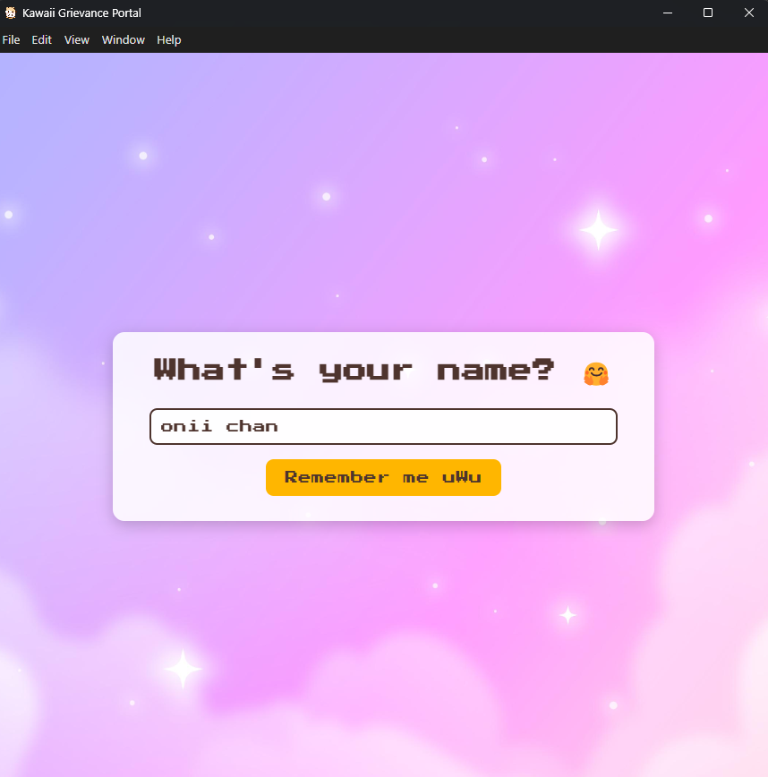
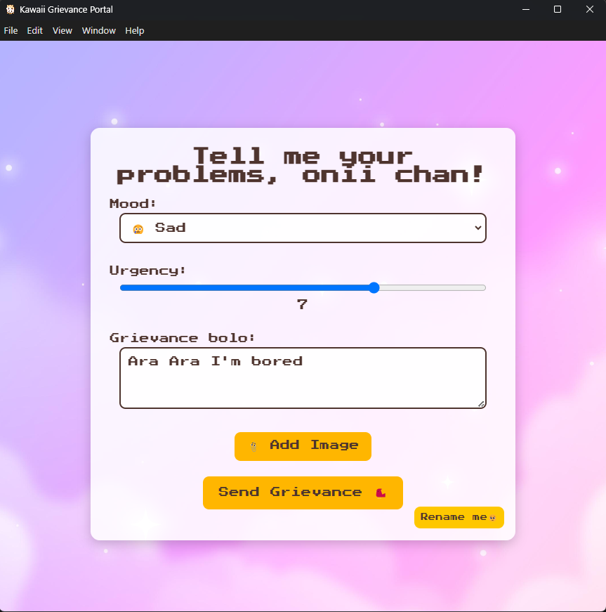
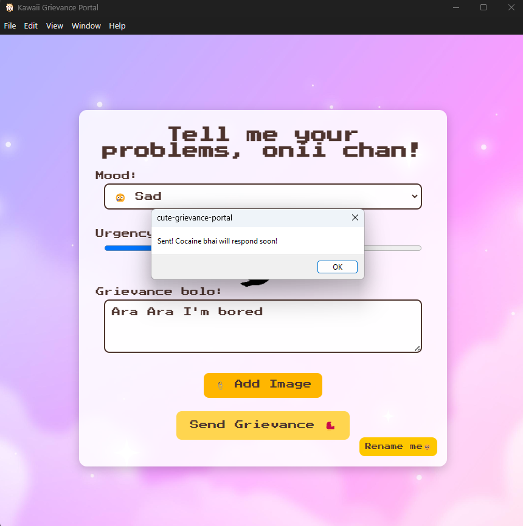
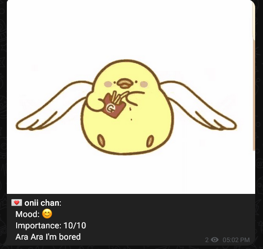

# Cute Grievance Portal

A kawaii-styled desktop app to share with your friends. Just a fun project I vibe coded in a few hours. It allows you to send grievances without any hosted server. It uses a Telegram bot to send messages directly to a channel or chat, which is absolutely free and easy to set up. 

## Setup and Run

1.  **Install Dependencies:**
    Open your terminal in the project root (`cute-grievance-portal/`) and run:
    ```bash
    npm install
    ```

2.  **Create Configuration File:**
    Create a file named `config.json` in the `cute-grievance-portal` directory.
    Add your Telegram Bot Token and Chat ID to this file:
    ```json
    {
      "BOT_TOKEN": "<YOUR_BOT_TOKEN_FROM_BOTFATHER>",
      "CHAT_ID": "<YOUR_TARGET_CHAT_ID>"
    }
    ```
    *   Replace `<YOUR_BOT_TOKEN_FROM_BOTFATHER>` with the token you received from @BotFather.
    *   Replace `<YOUR_TARGET_CHAT_ID>` with the ID of your Telegram channel (e.g., `-1001234567890`). To get the chat id, type ```https://api.telegram.org/bot<BOT_ID>/getUpdates``` into your browser, replacing `<BOT_ID>` with your bot's token. The chat ID will be in the response JSON under `message.chat.id`. (If you've set it up correctly, that is)

3.  **Place Assets:**
    *   Place your desired background image as `pixelback.png` inside the `assets/` folder.
    *   Place your flapping bird animation as `bird.gif` inside the `assets/` folder.
    If the `assets` folder doesn't exist in `cute-grievance-portal/`, please create it.

4.  **Start the App:**
    Run the following command in your terminal from the project root:
    ```bash
    npm start
    ```

## Building the App (Optional)

To package the application for distribution:

```bash
npm run pack
```
This will create a distributable version in a `dist` or similar directory, based on your `electron-builder` configuration. Ensure you run this using admin privileges if you're on Windows, that is how it worked for me.

A few screenshots of the app:
1. The login screen where you enter your name:

2. The grievance submission screen (You can send a 140-character grievance, along with the urgency level and an optional image): 

3. The notification screen after submitting a grievance:

4. How you can view your grievances on the telegram channel:
